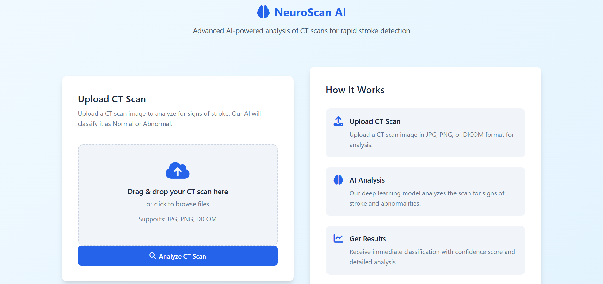
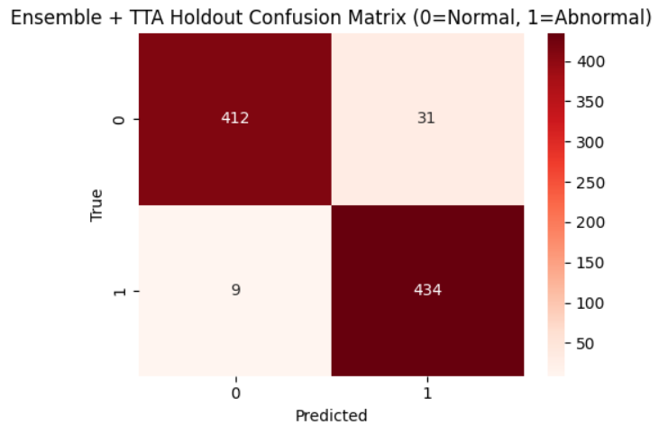
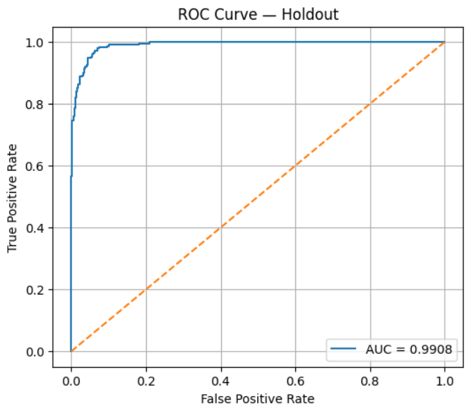
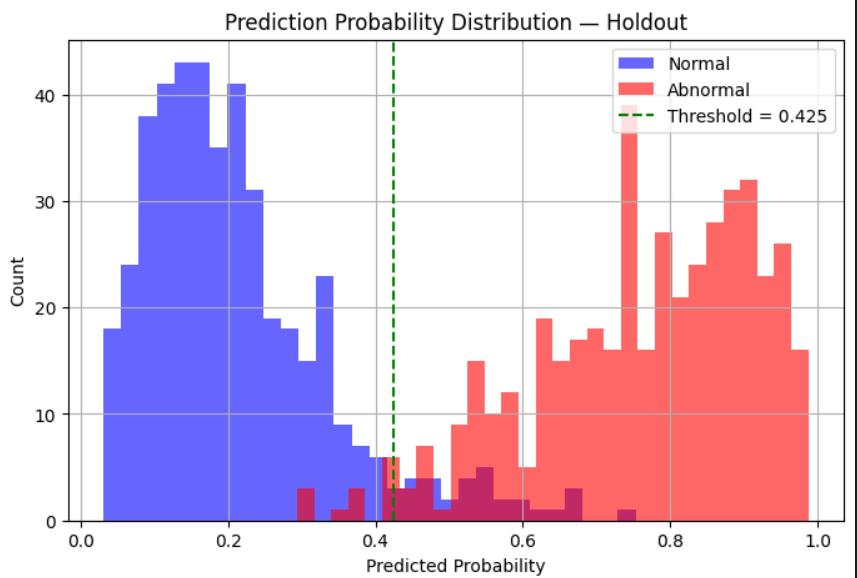

# 🧠 Stroke CT Classifier — EfficientNet-B3 Ensemble
A state-of-the-art deep-learning pipeline for **binary classification of Brain CT scans**  
(**Normal vs Stroke**) featuring advanced training strategies, strong regularization,  
and a production-ready Flask API.

---

## 🚀 Overview

This project provides a **complete end-to-end system** for training, evaluating, and deploying  
an EfficientNet-B3 model using:

- 5-fold cross-validation  
- Hard Negative Mining (HNM)  
- Focal Loss  
- Test-Time Augmentation (TTA)  
- Ensemble averaging  
- Flask inference API  
- Threshold tuning for clinical settings  

---

## ✨ Key Features

- 🧩 **EfficientNet-B3 (Noisy Student)** pretrained backbone  
- 🔄 **5-fold ensemble** → stable & reliable predictions  
- 🎚️ **Optimized threshold**: `0.425` for best sensitivity/specificity  
- 🧪 **TTA (H/V flips)** for better generalization  
- 🎯 **Hard Negative Mining** at epoch 6  
- ⚖️ **Focal Loss** for imbalanced data  
- 📈 **Complete evaluation suite**: ROC, PR, OOF, CM  
- 🔥 **Grad-CAM support** for explainability  
- ⚡ **Lightweight & fast** deployment-ready API  

---

## 📊 Final Holdout Performance

| Metric | Score |
|--------|--------|
| **Accuracy** | **95.49%** |
| **ROC-AUC** | **0.9908** |
| **Optimal Threshold** | **0.425** |
| **Holdout Size** | **886 CT slices** |

### Class-wise Metrics

| Class | Description | Precision | Recall | F1-Score | Support |
|-------|-------------|-----------|--------|----------|---------|
| **0** | Normal | 0.9786 | 0.9300 | 0.9537 | 443 |
| **1** | Stroke | 0.9333 | 0.9797 | 0.9559 | 443 |

---

## 🖼️ User Interface Preview  
A clean and simple interface for quick testing:

---

## 🧾 Prediction Outcome Example  
Sample outcome generated by the API:

---

## 📈 Evaluation Plots

### 🔢 Confusion Matrix  

### 📉 ROC Curve  

### 📊 Probability Distribution  

---

## 🧠 Why This Model?

- ✔ **CNN-based end-to-end system**  
- ✔ **Modern EfficientNet-B3 backbone**  
- ✔ **TTA + Ensemble = high stability**  
- ✔ **False-negative minimization** via Focal Loss + HNM  
- ✔ **Explainable through Grad-CAM**  
- ✔ **Fast API suitable for production**  
- ✔ **Simpler, cleaner, and more scalable** than multi-CNN pipelines  

---
